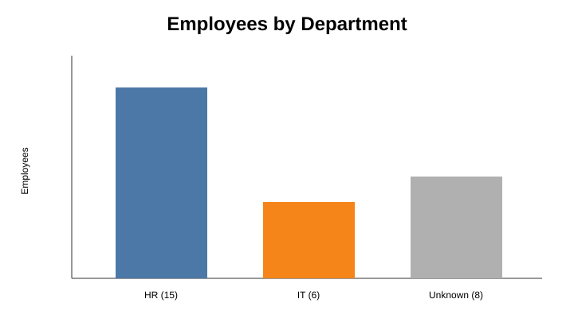
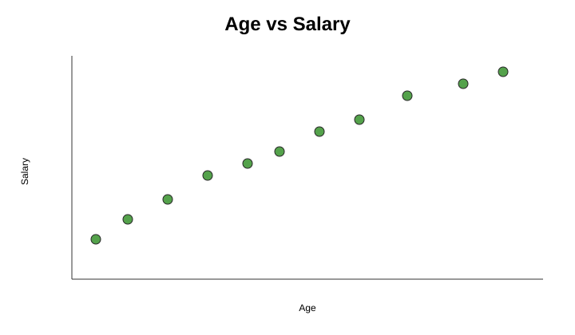
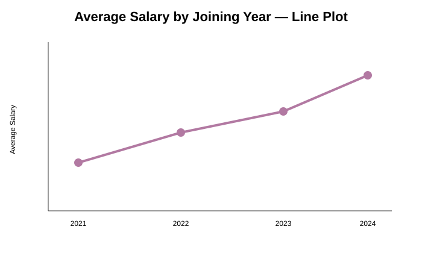
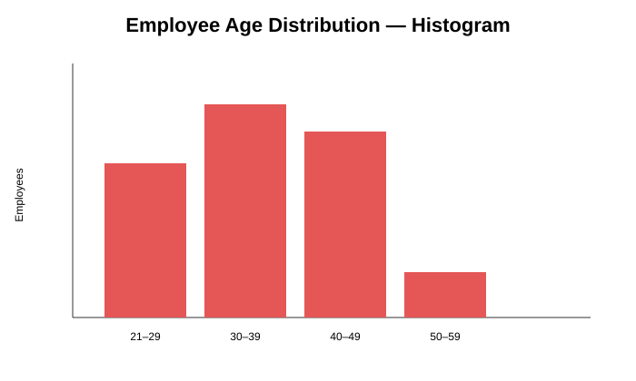

# Employee Data Cleaning and Visualization

This project demonstrates a reproducible employee-data workflow using **Python, pandas, Matplotlib, and Jupyter Notebook**. The notebook cleans the raw CSV, validates the result, exports `cleaned_data.csv`, and creates four charts from that cleaned output.

## What the code does

1. Loads and inspects the raw employee CSV.
2. Trims text fields and standardizes names and department labels.
3. Converts age, salary, and joining dates to usable data types.
4. Fills missing numeric values with column medians and removes invalid dates.
5. Removes only exact duplicate rows.
6. Detects salary outliers with the IQR rule (`Q1 - 1.5 × IQR` to `Q3 + 1.5 × IQR`).
7. One-hot encodes the department column as `Department_hr` and `Department_it`.
8. Validates that the output is non-empty, has no missing values, and contains no exact duplicates.
9. Saves the cleaned data and generates matching SVG and PNG charts in `visualizations/`.

The final checked dataset contains **29 rows and 6 columns**. Department counts are **HR: 15, IT: 6, and Unknown/other: 8**. The Unknown group represents records whose department is not HR or IT in the encoded output.

## Visualizations and what they show

### 1. Department distribution



The bar chart compares the number of employees in HR, IT, and Unknown/other categories. It shows that HR is the largest group in this sample.

### 2. Age and salary relationship



Each point represents one employee. The chart helps inspect whether salary increases consistently with age; this small sample shows substantial variation rather than a simple linear pattern.

### 3. Average salary by joining year



The line chart aggregates salaries by the year employees joined. It is useful for comparing yearly averages, but the number of employees differs between years, so it should be interpreted as an exploratory summary.

### 4. Employee age distribution



The histogram groups ages into four ranges: **21–29: 7**, **30–39: 10**, **40–49: 10**, and **50–59: 2**. Most employees in this dataset are between 30 and 49.

## Repository files

- `sample_data_cleaning_project - Sample_data_cleaning_project.csv` — raw input data
- `cleaningdata_final_submission_tested.ipynb` — documented cleaning and visualization workflow
- `cleaned_data.csv` — validated cleaned output
- `VISUALIZATIONS.md` — chart inventory and findings
- `visualizations/` — SVG previews and generated PNG charts
- `requirements.txt` — required Python packages

## Run the project

```bash
pip install -r requirements.txt
jupyter notebook cleaningdata_final_submission_tested.ipynb
```

Run all notebook cells from the repository root. The charts are exploratory summaries of this small sample and should not be used as formal compensation or workforce decisions.
