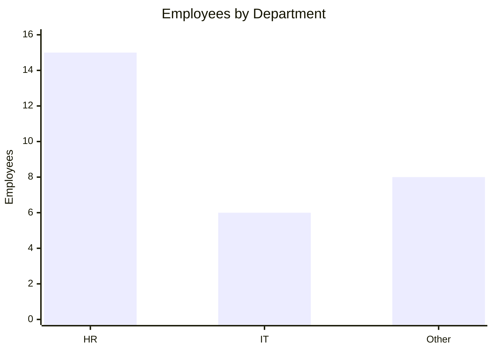
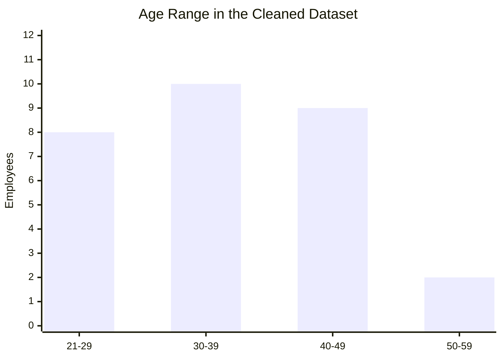

# Visualizations and Findings

This project uses the cleaned employee dataset to create four exploratory charts. Run `cleaningdata_final_submission_tested.ipynb` to regenerate the PNG files in the `visualizations/` directory.

## Dataset output

The notebook exports `cleaned_data.csv` after removing duplicates, filling missing values, converting dates, filtering salary outliers, and one-hot encoding departments.

| Output | Result |
|---|---|
| Cleaned rows | 29 |
| Cleaned columns | 6 |
| Department fields | `Department_hr`, `Department_it` |
| Output file | `cleaned_data.csv` |

## Chart previews

The cleaned data has 15 HR employees, 6 IT employees, and 8 employees without an encoded HR/IT department value.

## Saved visualizations

After running the notebook, open these image files:

- `visualizations/age_distribution.png` — shows how employee ages are distributed.
- `visualizations/salary_distribution.png` — shows the spread of salaries after outlier filtering.
- `visualizations/department_counts.png` — compares the number of employees by department.
- `visualizations/salary_by_department.png` — compares salary ranges across departments with box plots.

## Interpretation

The charts provide a quick view of workforce composition, age patterns, and salary variability. Because the dataset is small, these visualizations are useful for practicing data cleaning and exploratory analysis, but should not be used alone for formal compensation or workforce decisions.
