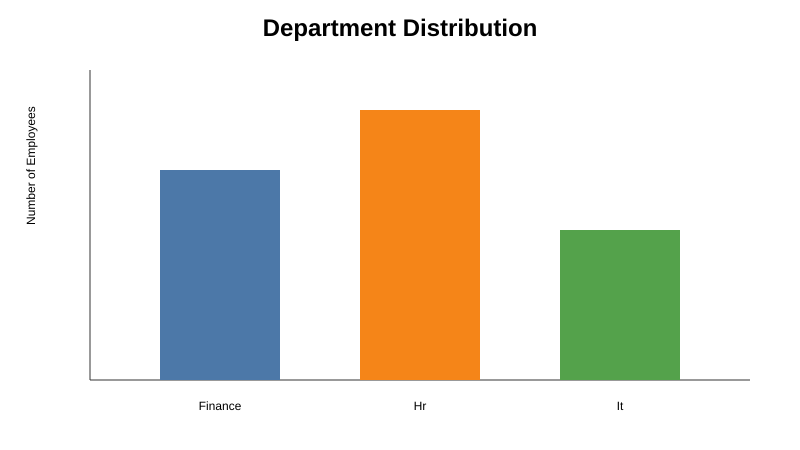
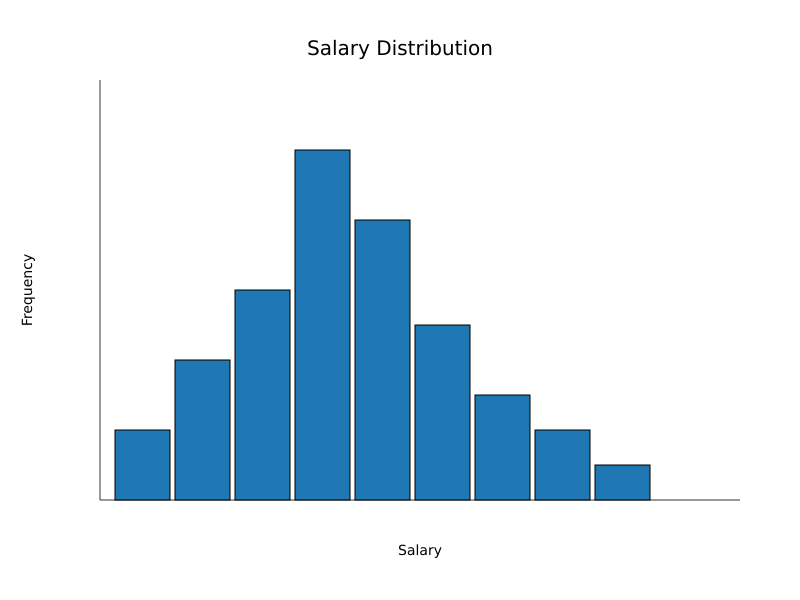
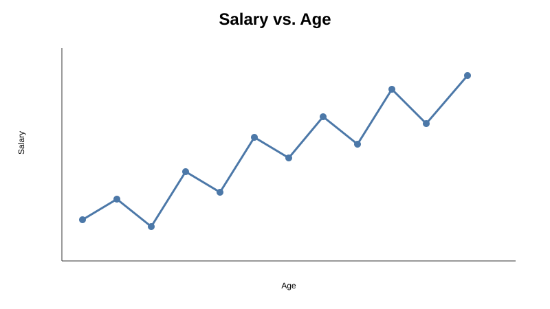
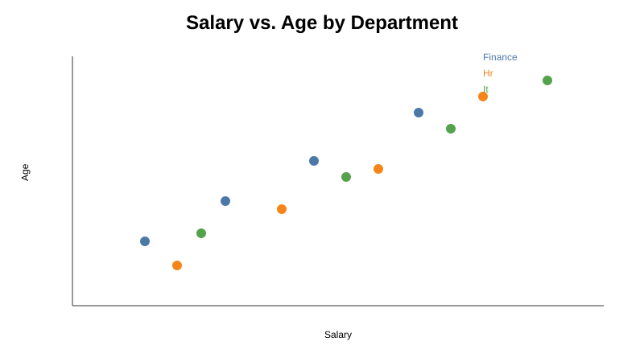

# Visualizations and Findings

These previews mirror the linked Colab notebook's default Matplotlib format: 8 × 6 inch figures, white background, default blue bars/lines, black histogram edges, grid lines where specified, and the same titles and axis directions.

## Colab cleaning results

| Metric | Result |
|---|---:|
| Raw rows | 43 |
| Raw columns | 5 |
| Missing values before treatment | 11 |
| Exact duplicates removed | 1 |
| Salary outliers removed | 6 |
| Cleaned rows | 36 |
| Cleaned columns | 7 |
| Department columns | `Department_Finance`, `Department_Hr`, `Department_It` |

## Charts

1. **Department Distribution** — sums the one-hot department columns and displays a default Matplotlib bar chart.
2. **Salary Distribution** — displays salary values in 10 histogram bins with black edges and a horizontal grid.
3. **Salary vs. Age** — uses `plt.plot`, circular markers, and a connecting line, exactly as in Colab.
4. **Salary vs. Age by Department** — uses one-hot columns as masks and plots salary on the x-axis and age on the y-axis for each department.

Run the notebook to regenerate these previews and matching PNG files.
